# OrcaSlicer Architecture Analysis

## Table of Contents
1. [Project Overview](#1-project-overview)
2. [Directory Structure](#2-directory-structure)
3. [Application Architecture](#3-application-architecture)
4. [Core Domain Classes](#4-core-domain-classes)
5. [UI Framework](#5-ui-framework)
6. [Build System](#6-build-system)
7. [Data Flow](#7-data-flow)
8. [Key Subsystems](#8-key-subsystems)
9. [Extension Points](#9-extension-points)

---

## 1. Project Overview

**OrcaSlicer** is an open-source 3D slicer application forked from Bambu Studio, which itself was forked from PrusaSlicer (originally based on Slic3r). The project uses **C++17** with **CMake** as the build system and is cross-platform (Windows, macOS, Linux).

### Key Technologies
- **Language**: C++17
- **GUI Framework**: wxWidgets 3.3+
- **Build System**: CMake
- **Parallel Processing**: Intel TBB (Threading Building Blocks)
- **Geometry**: CGAL, libigl, OpenCASCADE OCCT
- **Graphics**: OpenGL with GLFW + Glad

---

## 2. Directory Structure

```
OrcaSlicer/
├── src/
│   ├── OrcaSlicer.cpp          # Main entry point
│   ├── OrcaSlicer.hpp         # Main header
│   ├── libslic3r/              # Core slicing engine (platform-independent)
│   ├── slic3r/                 # GUI application (wxWidgets-based)
│   ├── libvgcode/              # G-code visualization
│   ├── glad/                   # OpenGL loader
│   └── dev-utils/
├── resources/                   # Icons, printer profiles, localization
├── tests/                       # Unit tests (Catch2)
├── deps/                        # Prebuilt dependencies
├── deps_src/                    # Third-party source libraries
├── cmake/                       # CMake modules
└── scripts/                     # Build and utility scripts
```

### Core Source Directory (`src/`)

```
src/
├── OrcaSlicer.cpp          # Main entry point (calls CLI().run())
├── OrcaSlicer.hpp          # Main header
├── OrcaSlicer_app_msvc.cpp # Windows GUI entry point wrapper
├── CMakeLists.txt          # Build configuration
├── libslic3r/              # Core slicing engine (platform-independent)
├── slic3r/                  # GUI application (wxWidgets-based)
├── libvgcode/              # G-code visualization library
├── glad/                   # OpenGL loader
└── dev-utils/              # Build utilities and platform files
```

### libslic3r Core Modules

| Directory | Purpose |
|-----------|---------|
| `GCode/` | G-code generation, cooling, pressure equalization, tool ordering, wipe tower |
| `Fill/` | Infill pattern implementations (gyroid, honeycomb, lightning, etc.) |
| `Support/` | Support generation (Tree supports, traditional supports) |
| `Geometry/` | Voronoi diagrams, medial axis, convex hull, arc welding |
| `Format/` | File I/O for 3MF, AMF, STL, OBJ, STEP, SL1 formats |
| `SLA/` | SLA-specific printing (hollowing, support points, pad generation) |
| `Arachne/` | Variable-width perimeter generation using skeletal trapezoidation |
| `Execution/` | TBB-based parallel execution utilities |

### GUI Directory (`src/slic3r/GUI/`)

```
GUI/
├── MainFrame.hpp           # Main window frame
├── GUI_App.hpp             # wxApp-derived main application class
├── Plater.hpp              # 3D view/plater panel
├── Tab.cpp/hpp             # Settings tabs
├── ConfigWizard.hpp        # First-run configuration wizard
├── Jobs/                   # Background job system
├── Gizmos/                 # Interactive tools (move, rotate, scale, cut)
├── Widgets/                 # Custom wxWidgets components
├── 3DScene.cpp/hpp         # OpenGL 3D rendering
├── DeviceManager.hpp       # Printer device management
└── Utils/                  # Network agents, printer communication
```

---

## 3. Application Architecture

### 3.1 Entry Point Flow

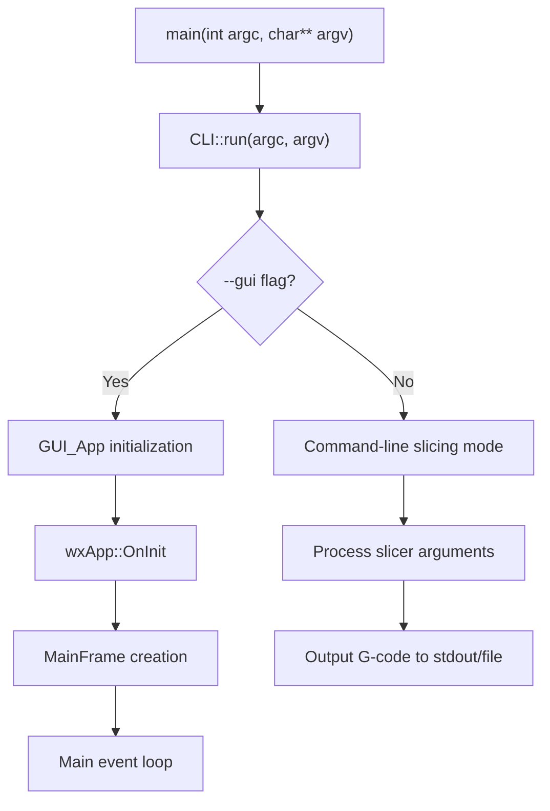

### 3.2 Layered Architecture

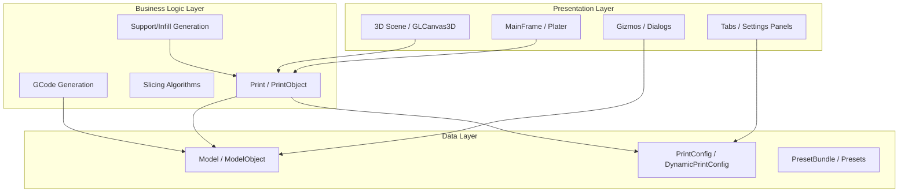

### 3.3 MVC-like Pattern in GUI

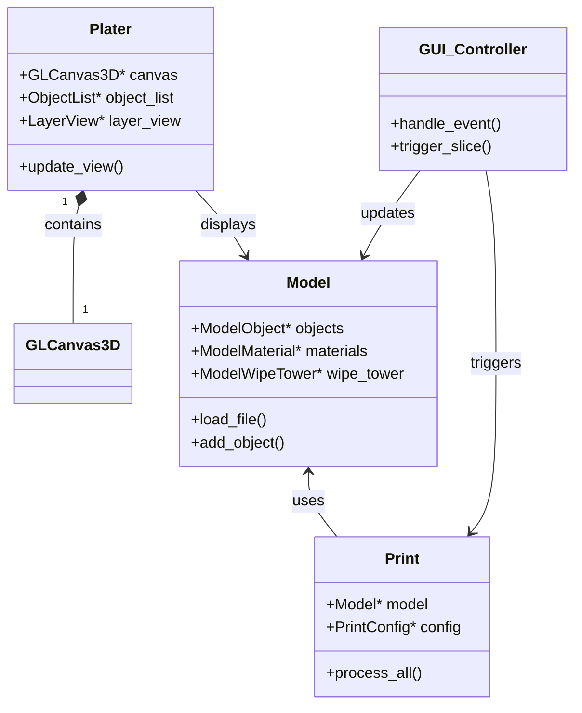

---

## 4. Core Domain Classes

### 4.1 Print Class Hierarchy

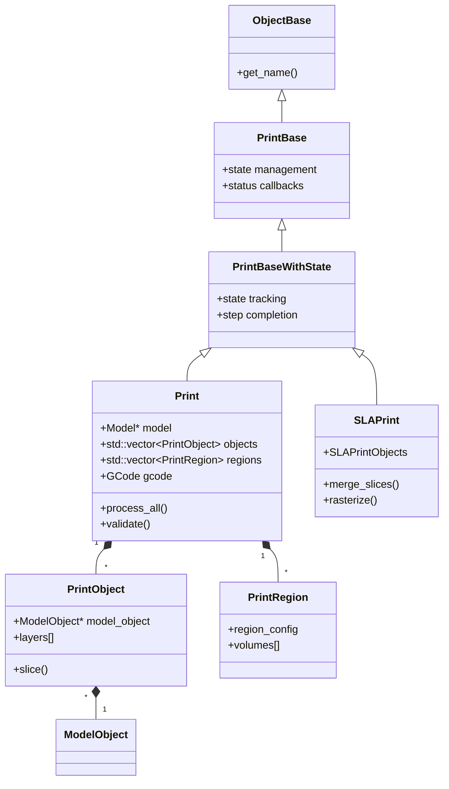

### 4.2 Model Class Hierarchy

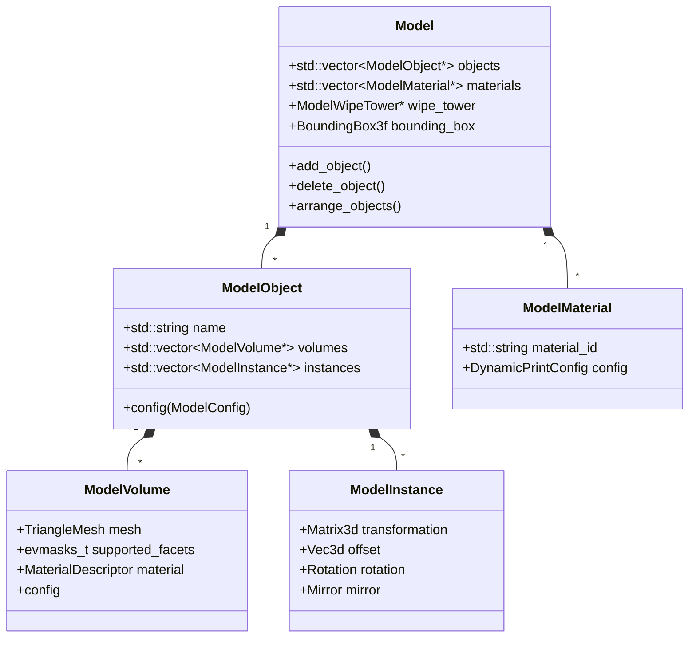

### 4.3 Configuration Class Hierarchy

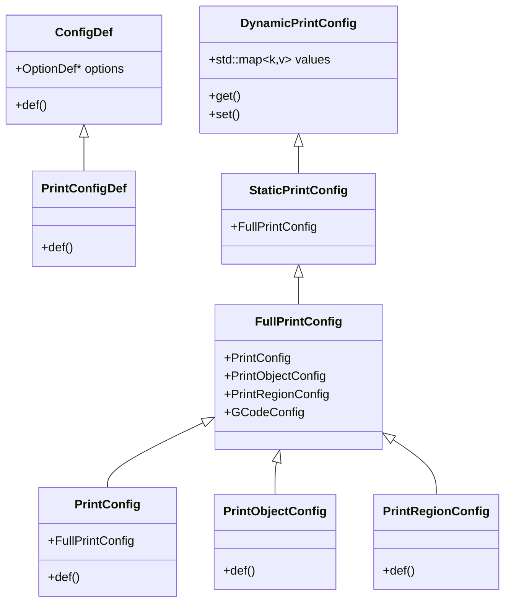

### 4.4 Key Classes Reference

| Class | Header | Purpose |
|-------|--------|---------|
| `Print` | `libslic3r/Print.hpp` | FDM print orchestration |
| `SLAPrint` | `libslic3r/SLAPrint.hpp` | SLA/DLP printing pipeline |
| `PrintObject` | `libslic3r/PrintObject.hpp` | Single object being sliced |
| `Model` | `libslic3r/Model.hpp` | Document containing all object data |
| `PrintConfig` | `libslic3r/PrintConfig.hpp` | Print settings container |
| `GCodeProcessor` | `libslic3r/GCode/GCodeProcessor.hpp` | G-code post-processing |
| `TriangleMesh` | `libslic3r/TriangleMesh.hpp` | 3D mesh representation |
| `Layer` | `libslic3r/Layer.hpp` | Single slicing layer |

---

## 5. UI Framework

### 5.1 Technology Stack

- **Framework**: wxWidgets 3.3+
- **OpenGL Context**: GLFW
- **OpenGL Loading**: Glad
- **UI Elements**: Custom widgets + ImGui overlays

### 5.2 Main Window Architecture

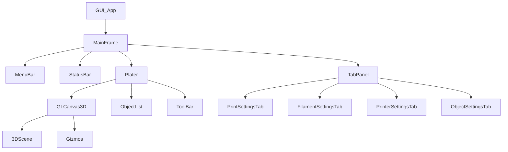

### 5.3 Key GUI Classes

| Class | Purpose |
|-------|---------|
| `GUI_App` | Main wxWidgets application instance |
| `MainFrame` | Main window with menu, toolbar, status |
| `Plater` | 3D plater view and object management |
| `GLCanvas3D` | OpenGL 3D rendering canvas |
| `Tab` | Settings tab base class |
| `ConfigWizard` | First-run printer configuration |
| `DeviceManager` | Printer device management |
| `Jobs::Job` | Background task base class |

---

## 6. Build System

### 6.1 CMake Architecture

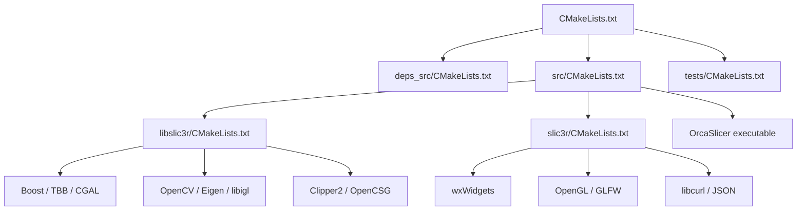

### 6.2 Key Dependencies

| Library | Purpose | Type |
|---------|---------|------|
| **Boost** | Utility functions, filesystem, threading | Header + Libraries |
| **TBB** | Intel Threading Building Blocks | Parallel processing |
| **wxWidgets** | Cross-platform GUI | GUI Framework |
| **OpenGL/GLFW** | 3D rendering | Graphics |
| **CGAL** | Computational Geometry Algorithms | Geometry operations |
| **OpenCV** | Computer vision | Mesh processing |
| **Eigen** | Linear algebra | Math operations |
| **Clipper2** | Polygon clipping | 2D geometry |
| **libigl** | Geometry processing | Mesh utilities |
| **OCCT** | CAD support | STEP import |
| **cereal** | Serialization | Config save/load |
| **libcurl** | HTTP networking | Cloud features |

### 6.3 Build Options

| Option | Description |
|--------|-------------|
| `SLIC3R_STATIC=1` | Static linking of Boost, TBB |
| `SLIC3R_GUI=1` | Build GUI components (default ON) |
| `SLIC3R_PCH=1` | Use precompiled headers |
| `BUILD_TESTS=1` | Build unit tests |

### 6.4 Build Commands

```bash
# Configure
cmake -S . -B build -DCMAKE_BUILD_TYPE=Release

# Build
cmake --build build --target OrcaSlicer --config Release --parallel

# Run tests
cmake --build build --target tests
ctest --test-dir build --output-on-failure
```

---

## 7. Data Flow

### 7.1 Slicing Pipeline

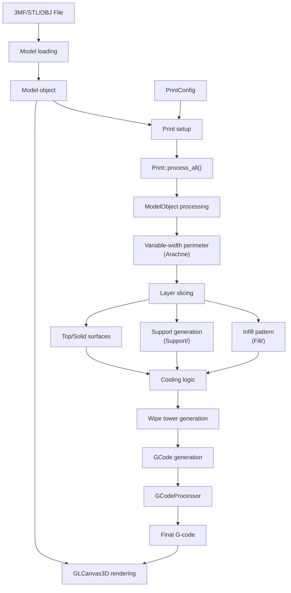

### 7.2 User Interaction Flow

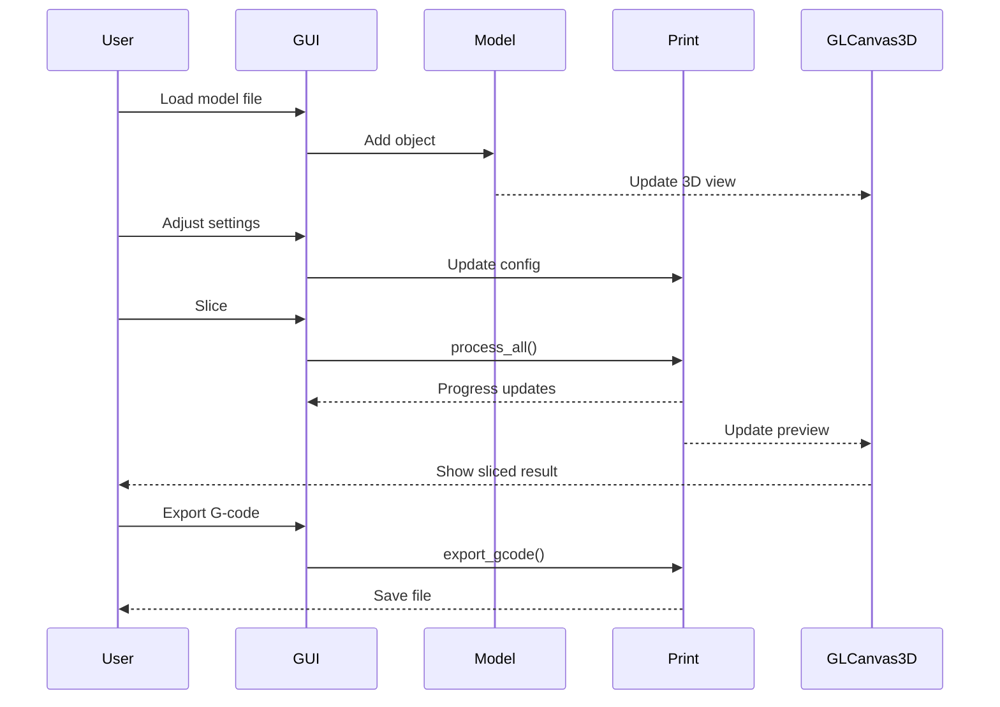

---

## 8. Key Subsystems

### 8.1 Slicing Algorithms

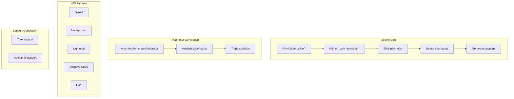

### 8.2 File Format Support

| Format | Parser | Features |
|--------|--------|----------|
| **3MF** | `libslic3r/Format/3mf.cpp` | Full read/write with embedded data |
| **AMF** | `libslic3r/Format/amf.cpp` | Read/write with materials |
| **STL** | `libslic3r/Format/stl.cpp` | Binary/ASCII STL |
| **OBJ** | `libslic3r/Format/obj.cpp` | Wavefront OBJ |
| **STEP** | `libslic3r/Format/step.cpp` | CAD import via OCCT |
| **SL1** | `libslic3r/Format/sl1.cpp` | SLA print files |

### 8.3 Printer Host Integration

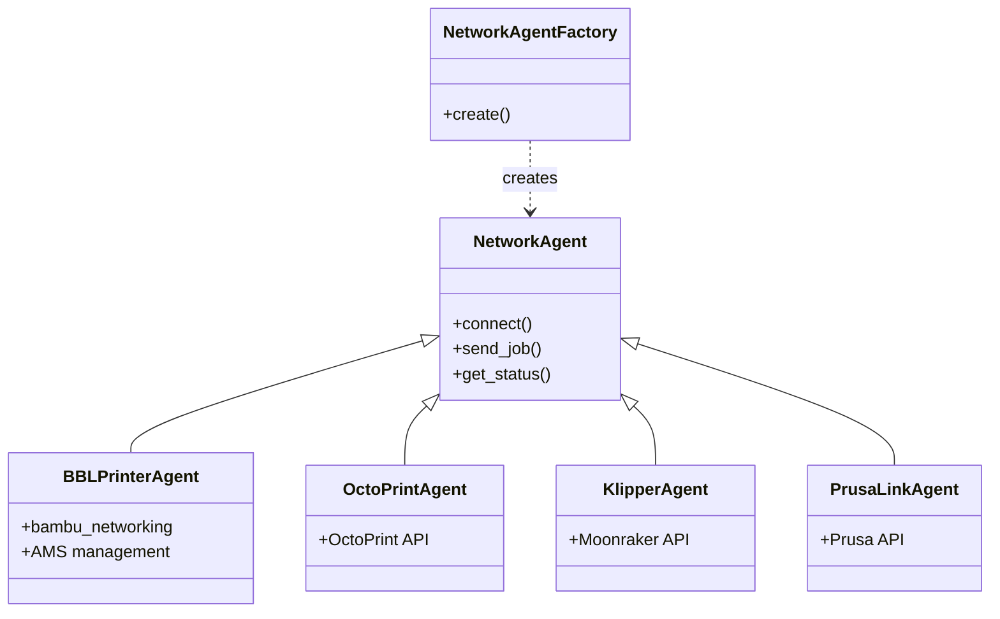

### 8.4 Calibration System

Located in `src/slic3r/Utils/CalibUtils.cpp`:
- Temperature towers
- Flow rate calibration
- Retraction tests
- Pressure advance
- Input shaper

---

## 9. Extension Points

### 9.1 Plugin Architecture

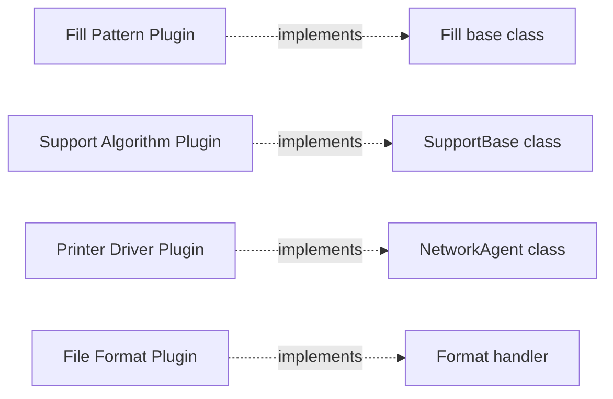

### 9.2 Preset System

```
PresetBundle
├── PrinterPresets[]
├── FilamentPresets[]
└── PrintPresets[]

PresetUpdater (remote update mechanism)
```

### 9.3 Custom Widget Extension

Custom widgets can be added to `src/slic3r/GUI/Widgets/` directory following wxWidgets patterns.

---

## 10. Threading Model

- **TBB (Threading Building Blocks)**: Parallel slice processing
- **Boost threads**: Background operations
- **GUI**: Main thread with async jobs for:
  - Slicing
  - Arrange
  - Network operations
  - File I/O

---

## 11. Summary

OrcaSlicer follows a **modular monolithic** architecture:

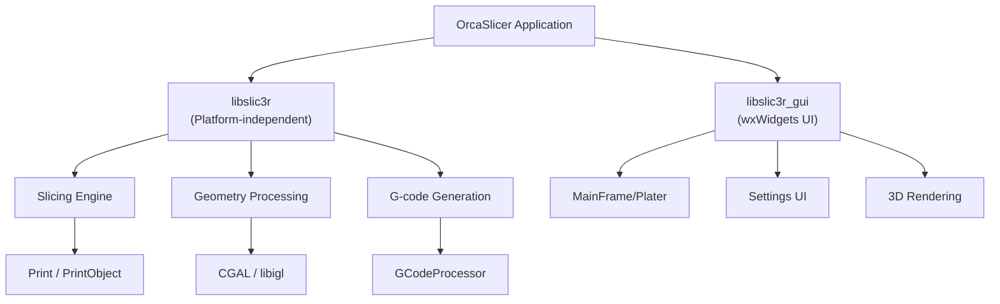

### Key Architectural Decisions

1. **Separation of concerns**: libslic3r is platform-independent
2. **Design patterns**: Factory (printer agents), Observer (events), Strategy (fill patterns)
3. **Extensibility**: Plugin-like architecture for fill patterns, supports, formats
4. **Cross-platform**: wxWidgets ensures native look on Windows/macOS/Linux
5. **Performance**: TBB for parallel processing, efficient geometry libraries

---

*Document generated for OrcaSlicer architecture understanding.*
*Last updated: 2026-04-23*
